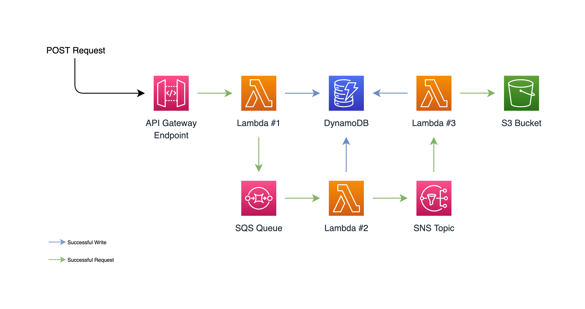
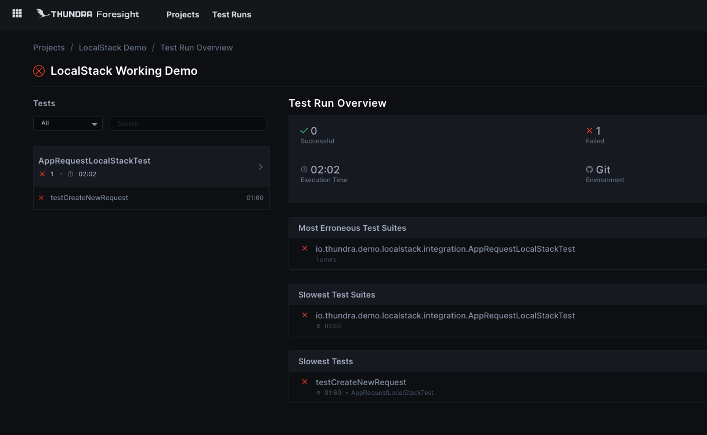
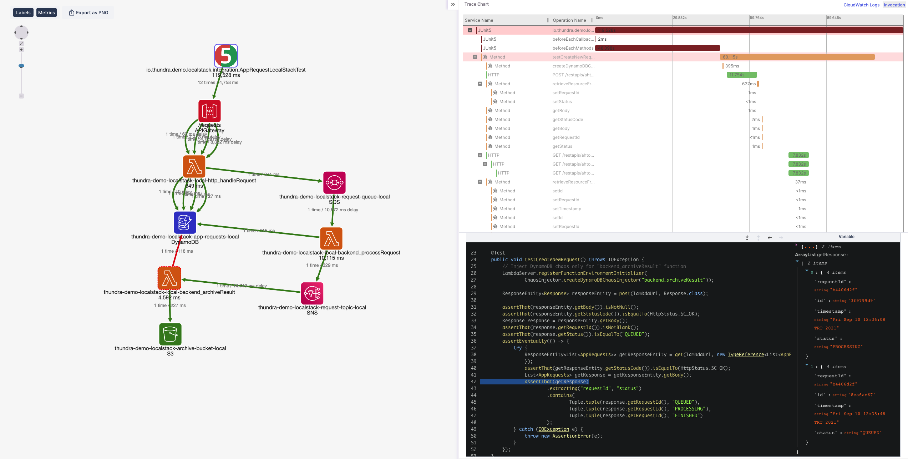

# Thundra LocalStack Demo

Simple Java demo application deployed to LocalStack and monitored/traced/debugged by Thundra

## API Design



## Prerequisites

* LocalStack
* Docker
* Python 3+
* JDK 8+
* Maven 3+
* Node.js / `npm`
* `make`

## Installing

Install the dependencies using this command:
```
make install
```

Set your Thundra API key and project id into `Makefile`
```
export THUNDRA_APIKEY = <YOUR-THUNDRA-API-KEY-HERE>
export THUNDRA_AGENT_TEST_PROJECT_ID = <YOUR-THUNDRA-PROJECT-ID-HERE>
```

## Running the Application

Start the application locally in LocalStack:
```
make start-embedded
```

## Running the Tests

You don't need to start the application to run the tests. You can simply run the following command.

```
make test
```

This will run the tests with `start-embedded`. If you want to run the tests without Thundra's Lambda Server, you can update the `LocalStackTest.java` file to run the `make start` instead of the `make start-embedded`. However, since the deployment and cold starts takes time, it might fail. Ideally, you would start the application beforehand and remove `executeCommand()` from `LocalStackTest.java`.


### Results

If you set the `THUNDRA_APIKEY` and `THUNDRA_AGENT_TEST_PROJECT_ID` in the `Makefile`, Thundra Foresight and APM should show the following results.

#### Thundra Foresight Testrun Detail



#### Thundra APM Trace Map



## Testing

Get your API endpoint from the deploy output by `endpoints` property:
```
...
Service Information
service: thundra-demo-localstack
...
endpoints:
  http://localhost:4566/restapis/${apiId}/${stage}/_user_request_
functions:
  http_handleRequest: thundra-demo-localstack-local-http_handleRequest
  backend_processRequest: thundra-demo-localstack-local-backend_processRequest
  backend_archiveResult: thundra-demo-localstack-local-backend_archiveResult
...
```

And then send the request to your endpoint on Localstack:
```
curl http://localhost:4566/restapis/${apiId}/${stage}/_user_request_/${path}
```

For http_handleRequest service, you can send the request in the following format:
```
curl "http://localhost:4566/restapis/${apiId}/${stage}/_user_request_/requests"
curl -X POST "http://localhost:4566/restapis/${apiId}/${stage}/_user_request_/requests"
```

## License

This code is available under the Apache 2.0 license.
